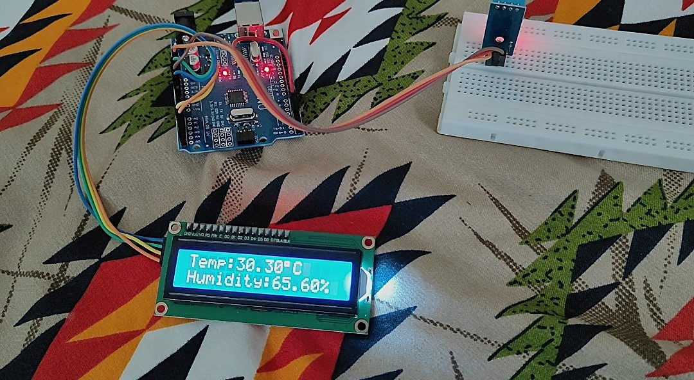

# temp-humidity-monitor
Arduino project to measure and display temperature and humidity using DHT11 and I2C LCD
# 🌡️ Temperature & Humidity Monitor using Arduino

This is a beginner-friendly Arduino project that displays real-time **temperature** and **humidity** data using a **DHT11 sensor** and a **16x2 I2C LCD display**. The project was completed as part of my first-year ECE summer vacation learning goals.

## 🔧 Components Used
- Arduino Uno
- DHT11 Digital Temperature & Humidity Sensor
- 16x2 LCD Display with I2C Module
- Breadboard
- Jumper Wires

## ⚙️ How It Works
- The **DHT11 sensor** measures ambient temperature and humidity.
- The **Arduino Uno** receives this data through a digital pin.
- The **I2C LCD** displays the temperature and humidity values live.
- Data is updated every 2 seconds.

## 📌 Features
- Real-time temperature and humidity display
- Clean LCD output using I2C interface

## 🧠 What I Learned
- Sensor interfacing using digital pins
- Using I2C for simpler LCD wiring
- Debugging circuits and uploading code via Arduino IDE
- Understanding of Vcc, GND, and signal connections

## 🔋 Circuit Diagram
- DHT11 → Vcc to 5V, GND to GND, Data to Digital Pin (e.g., D2)
- I2C LCD → Vcc to 5V, GND to GND, SDA to A4, SCL to A5 (for Uno)

## 💻 Arduino Code
Check the `temperature-humidity.ino` file in this repo.

## 📸 Project Image

## 📅 Status
✅ Project Completed  
🎓 Built during 1st year summer vacation (Electronics and Communication Engineering)

